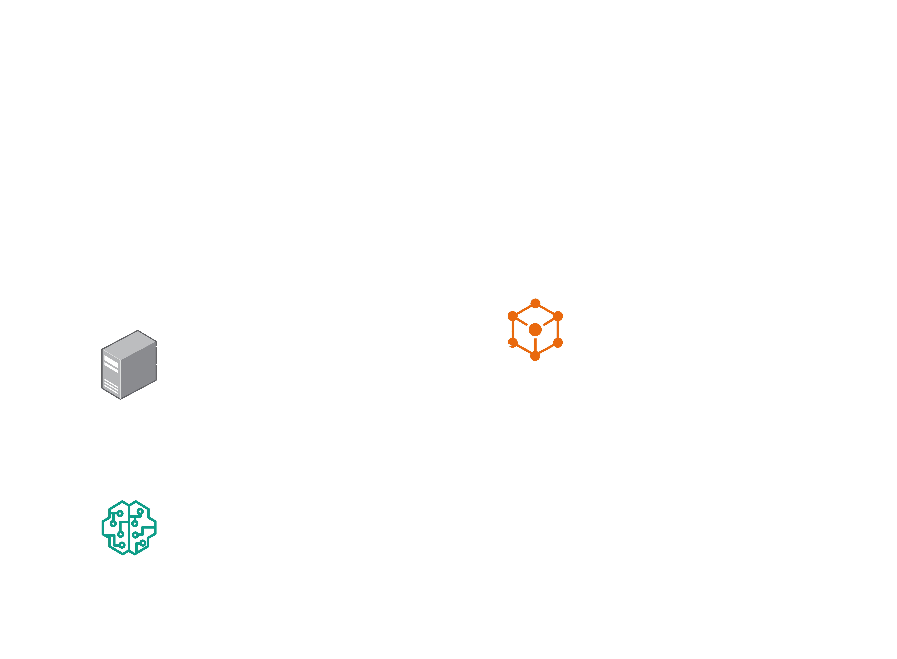

# 🏎️ F1 Crowd Intelligence Platform (GrandPrix MVP)

An AI-driven digital twin and real-time crowd management platform designed to predict, monitor, and mitigate crowd congestion and risks at massive live events like Formula 1 races. 

## 🚨 The Problem
Massive live events containing hundreds of thousands of spectators are highly unpredictable. Event organizers currently face major challenges:
1. **Dangerous Crowd Crushes:** Sudden bottlenecks at gates, food zones, or grandstands can lead to dangerous crushes.
2. **Reactive, Not Proactive:** Operations teams rely on CCTV and radio, meaning they only react *after* a bottleneck forms.
3. **Unexpected Incidents:** Sudden weather changes (heavy rain), route closures, or medical emergencies cause chaotic, unpredictable crowd shifts.
4. **Poor Attendee Experience:** Spectators get trapped in massive queues without knowing alternative, faster routes to their destination.

## 💡 Our Solution
The **F1 Crowd Intelligence Platform** solves this by creating a real-time **Digital Twin** of the venue. By combining a real-time agent-based simulation engine, machine learning density forecasting, and a Generative AI Copilot, the platform empowers race organizers to proactively manage the crowd.

### Key Features
* 📊 **Real-Time Digital Twin Simulation:** A Node.js backend continuously simulates the movement of thousands of individual agents moving through a graph-based venue model using Congestion-Aware A* Pathfinding.
* 🔮 **10-Min Predictive Forecasting:** A Python/FastAPI service using a trained `RandomForestRegressor` analyzes current flow rates and weather to accurately predict venue bottlenecks **10 minutes into the future**.
* 🧠 **Generative AI Operations Copilot:** An integration with Hugging Face Serverless APIs. When risk levels spike, the AI analyzes the data and instantly recommends operational mitigations (e.g., "Reroute Gate A traffic to Gate C"). It includes a **Deterministic Fallback Engine** ensuring zero downtime even if the AI API fails.
* 🧪 **What-If Scenario Studio:** An isolated sandbox where organizers can test disaster responses (e.g., "What happens if we close Route E16 right now?") on a cloned simulation state without affecting live operations.
* 📱 **Spectator Route Optimizer:** A mobile-friendly dashboard for attendees to dynamically find the safest, fastest routes across the venue that automatically avoids live closures.

---

## 🏗️ System Architecture & Data Flow


*A visual overview of the GrandPrix MVP architecture, featuring the three decoupled microservices.*

The MVP operates across three main decoupled components:

1. **Simulation Engine & Main Backend (Node.js / Express / Socket.IO)**
   - Acts as the central nervous system. 
   - Runs a highly optimized 10-second "Tick Clock".
   - Updates the A* paths of 2,000+ agents based on the race schedule (Qualifying, Race, Exit Rush) and live incident triggers.
   - Computes live Risk Scores based on density and wait times.

2. **Machine Learning Prediction Service (Python / FastAPI / Scikit-Learn)**
   - Exposes a `/predict/batch` endpoint.
   - Every tick, the Node.js backend sends the current venue state here.
   - Returns precise 10-minute density predictions, allowing the UI to flag areas that *will* become critical before they actually do.

3. **F1 Command Center Frontend (Next.js / React / Tailwind / Framer Motion)**
   - Connects to the backend via a persistent Socket.IO WebSocket.
   - Renders a stunning, premium "F1 Dark Mode" UI.
   - Features real-time Recharts forecasting, dynamic HTML5 canvas circuit heatmaps, and interactive Incident Control triggers.

---

## 🚀 How to Run the MVP Locally

This platform consists of three separate microservices. You will need three separate terminal windows to run them concurrently.

### 1. Run the Python Prediction Service
Requires Python 3.8+
```bash
cd prediction-service
# (Optional) Create and activate a virtual environment
# python -m venv venv && source venv/bin/activate (mac/linux) or venv\Scripts\activate (windows)
pip install -r requirements.txt
uvicorn main:app --reload --port 8000
```
*The Prediction API will be live at `http://localhost:8000`*

### 2. Run the Main Node.js Backend
Requires Node.js v18+
```bash
cd backend
npm install
npm run dev
```
*The Backend & Socket.IO Gateway will be live at `http://localhost:5000`*

### 3. Run the Next.js Frontend
Requires Node.js v18+
```bash
cd frontend
npm install
npm run dev
```
*The F1 Command Center will be live at `http://localhost:3000`*

---

## 🎯 Navigating the Demo

1. **Start the Engine:** Open `http://localhost:3000/dashboard` and click the pulsing **"START"** button to launch the live simulation.
2. **Watch the AI Predict:** Observe the "10-Min ML Density Forecast" widget in the bottom right; it queries Python every tick to plot future bottlenecks.
3. **Trigger an Incident:** Click "Close Route E16". Watch the map instantly update the route to red, and see the thousands of simulated agents instantly recalculate their paths.
4. **Consult the AI Copilot:** As risks rise from your incident, the AI Copilot will formulate a live operational strategy with a reasoning explanation.
5. **Test a What-If Scenario:** Navigate to the "What-If Studio" tab to clone the live simulation and safely test the impact of a Medical Emergency without touching the live race data.
6. **Mobile Spectator App:** Navigate to the "Spectator Route Optimizer" tab to see what the fans see—a live, rerouting GPS avoiding the closed routes.

---
*Built for Hackathon MVP Demonstration.*
