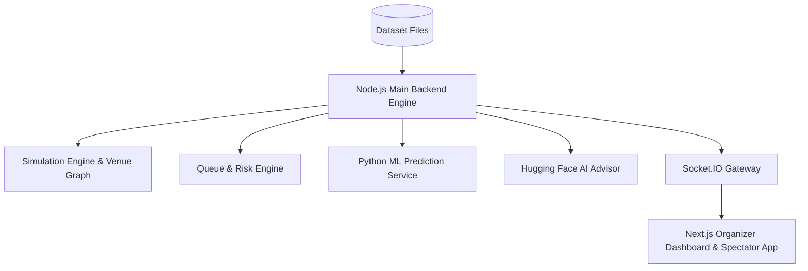

# System Architecture — F1 Crowd Intelligence Platform

## Overview
The F1 Crowd Intelligence Platform (Crowd Flow Optimiser) is a real-time digital twin simulation and crowd management system designed for Formula 1 circuits.

## System Components
1. **Node.js Main Backend (Port 5000)**: Real-time simulation loop, agent state machine, venue graph, dynamic A* routing, queue engine, risk engine, REST API, Socket.IO server. Written in pure JavaScript (ES Modules).
2. **Python Prediction Service (Port 8000)**: FastAPI service executing a trained RandomForestRegressor model predicting 10-minute future node density ratios.
3. **Hugging Face AI Reasoning Layer**: Uses `@huggingface/inference` to translate simulation state, risk alerts, and ML predictions into actionable operational advice with a deterministic rule-based fallback.
4. **Next.js Frontend (Port 3000)**: React & TypeScript dashboard with Leaflet/MapLibre map, risk heatmaps, density prediction charts, incident control center, scenario comparison studio, and spectator navigation.

## Data Isolation & Abstraction
- In-memory application state managed via `InMemoryStorage` repository implementation of `StorageService`.
- No database (PostgreSQL/Redis) or microservice messaging queue (Kafka/RabbitMQ) infrastructure is required for the MVP.
