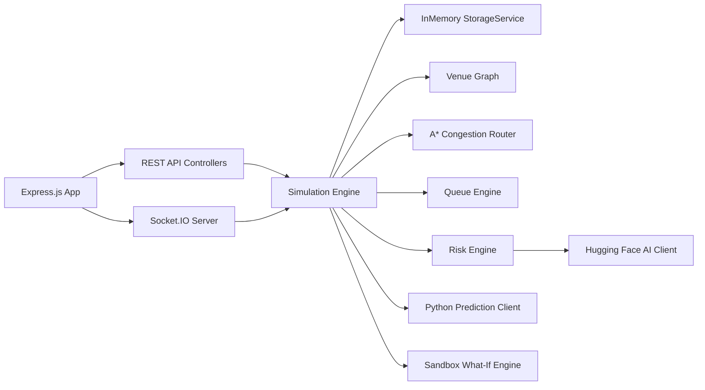

# Backend Architecture — Node.js Express Engine

## Core Philosophy
The main backend is built with **Node.js, Express, and modern JavaScript (ES Modules)**. It is strictly **JavaScript ONLY** (no TypeScript on the main backend).

## Backend Component Topology

## Domain Responsibilities
1. **Simulation Clock**: Executes 10-second tick loops, triggering agent movement, occupancy updates, and event progression.
2. **Venue Graph**: Represents 18 nodes and 23 edges, maintaining capacities, flow rates, and blocked state flags.
3. **A* Router**: Computes congestion-aware costs ($Distance \times (1 + 3 \cdot Density^2)$) and recalculates agent routes upon edge closures.
4. **Risk Engine**: Deterministic multi-factor risk calculation combining density (40%), flow pressure (20%), queue pressure (15%), route pressure (15%), and weather impact (10%).
5. **Storage Abstraction**: Clean `StorageService` interface allowing seamless future migration from `InMemoryStorage` to `PostgresStorage`.
