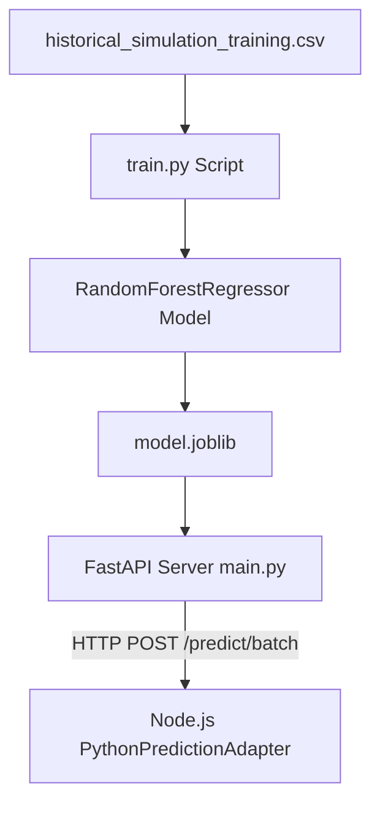

# Prediction Architecture — Python ML Service

## Overview
The Python prediction service is an isolated ML API built with **FastAPI, pandas, scikit-learn, and joblib**.

## Input Features & Target
- **Features**: `zone`, `event`, `weather`, `attendance`, `current_density_ratio`, `flow_rate_ratio`, `queue_length`, `blocked_route`.
- **Target**: `future_density_10min_ratio`.
- **Model**: Scikit-learn `RandomForestRegressor`.

## Resiliency & Timeout Handling
- Node.js invokes Python API every 30 seconds (or 3 simulation ticks).
- If Python API times out (> 2.0s) or fails, Node.js falls back to last known prediction or linear extrapolation to ensure continuous simulation operation.
