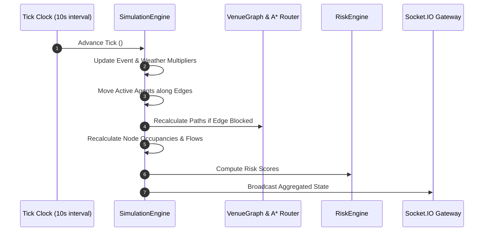

# Simulation Architecture — Tick Loop & Agent Movement Engine

## Core Simulation Cycle
The Node.js backend runs a discrete 10-second tick simulation clock (`SimulationEngine`).

## Agent Movement Rules
- Each agent advances along current edge based on persona speed (`speed_mps`) scaled by weather penalty.
- Arriving at node updates node occupancy and triggers destination evaluation based on current F1 event.
- If destination is a queue facility (`FOOD_N`, `FOOD_S`, `MERCH`, `PIT_WALK`), agent enters queue state.
