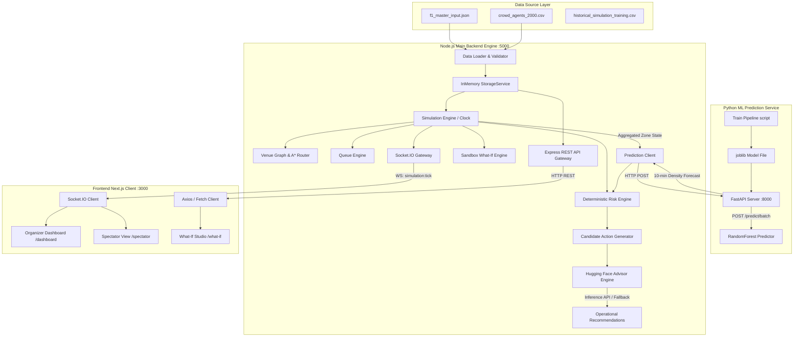
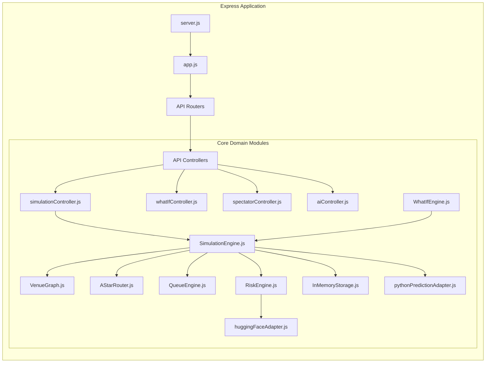
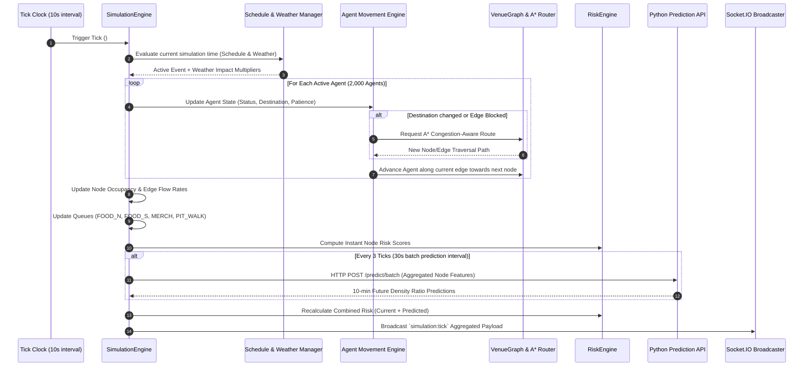
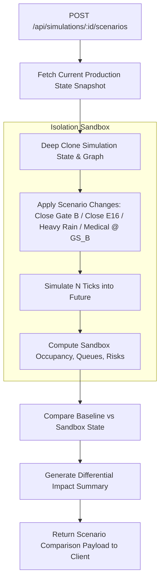
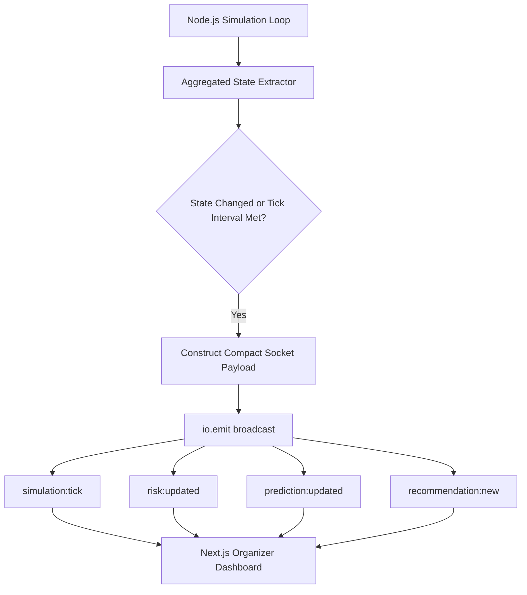
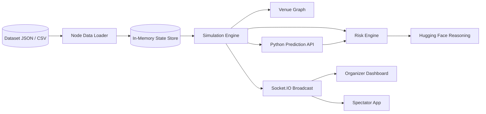

# F1 Crowd Intelligence Platform (Crowd Flow Optimiser) — Master Architecture & Implementation Plan

> **System Status:** Architecture & Planning Phase  
> **Backend Paradigm:** Node.js (JavaScript ES Modules) + Python FastAPI (Scikit-Learn ML) + Hugging Face Inference (`@huggingface/inference`)  
> **Frontend Paradigm:** Next.js (App Router, TypeScript, Tailwind CSS, shadcn/ui, Leaflet/MapLibre, Socket.IO)  
> **Execution Strategy:** Strict **Backend-First Development** (Backend M1–M11 completed and verified prior to Frontend M1–M10).

---

## 1. Executive Summary & Problem Statement

### 1.1 Context
Formula 1 Grand Prix events attract over 120,000 live spectators per day per circuit. Moving large crowds through bottlenecks (turnstiles, merchandise plazas, food courts, narrow footbridges, pit walks, and transport hubs) creates severe operational safety risks, long wait queues, visitor dissatisfaction, and emergency vehicle access delays.

### 1.2 Objective
The **F1 Crowd Flow Optimiser** is a real-time digital twin and crowd intelligence platform designed to:
1. **Simulate spectator dynamics** across an F1 venue graph using 2,000 multi-persona agents scaled to represent full venue attendance.
2. **Detect and predict congestion** up to 10 minutes in advance using a dedicated Python Machine Learning regression service.
3. **Assess multi-factor operational risk** deterministically based on density, flow pressure, queue length, route pressure, and weather severity.
4. **Dynamically reroute agents** around bottlenecks and closed pathways using congestion-aware A* graph routing.
5. **Generate AI-powered operational advice** using Hugging Face inference to provide natural language explanations and actionable rerouting/staffing mitigation commands.
6. **Provide Sandbox What-If Scenarios** to simulate route closures, gate shutdowns, and weather shifts without mutating the active production simulation state.
7. **Expose Dual Interfaces**: An **Organizer Control Center Dashboard** for venue operations and a lightweight **Spectator Route Optimizer** for attendee guidance.

---

## 2. MVP Scope & Explicit Exclusions

### 2.1 In Scope (MVP)
* Synthetic digital twin graph of 18 venue nodes and 23 directional/bi-directional edges loaded from `data/f1_master_input.json`.
* Population of 2,000 agents with distinct personas loaded from `data/crowd_agents_2000.csv`.
* Node.js / Express simulation engine running deterministic 10-second ticks (with start, pause, resume, reset, speed controls).
* Personas influencing walking speed, patience, group size, and destination probability distributions.
* F1 schedule events (ENTRY, PRACTICE, LUNCH, PIT_LANE_WALK, QUALIFYING, RACE, PODIUM, EXIT_RUSH) dynamically shifting destination probabilities.
* Weather events (sunny, cloudy, rain, heavy_rain) altering speed, patience, and route selection.
* Dynamic queue engine for `FOOD_N`, `FOOD_S`, `MERCH`, and `PIT_WALK` calculating queue lengths and wait times.
* Dynamic congestion-aware A* routing with edge blocking and instant agent path recalculation.
* Python FastAPI service training a `RandomForestRegressor` model on `historical_simulation_training.csv` serving 10-minute future density predictions (`future_density_10min_ratio`).
* Deterministic Risk Engine computing 4-tier risk scores (SAFE, MODERATE, HIGH, CRITICAL).
* Hugging Face integration (`@huggingface/inference`) generating validated operational recommendations with a deterministic fallback engine.
* Sandbox What-If simulation engine running isolated scenario comparisons (Gate B closure, E16 closure, Heavy Rain, Medical Incident at GS_B).
* Socket.IO real-time aggregated state broadcasting (zone densities, edge flows, risks, predictions, queues, incidents, recommendations).
* Organizers' Control Center dashboard with Leaflet/MapLibre venue map, heatmaps, timeline prediction charts, risk summary, and AI copilot.
* Spectator interface with circuit map, schedule, blocked route warnings, alternative route advice, and estimated walking times.

### 2.2 Explicitly Excluded (MVP)
* **PostgreSQL / Prisma / ORMs**: Data stays in-memory with file JSON/CSV loading (behind `StorageService` abstraction).
* **Redis / Kafka / RabbitMQ**: Real-time messaging uses direct Socket.IO in Node.js.
* **Microservices Infrastructure**: Only two runtime services: Main Node.js backend and Python prediction API.
* **Physical 2D/3D Agent Micro-Physics**: Graph edge & node discrete step traversal replaces expensive continuous collision detection.
* **TypeScript on Main Backend**: Main Node.js backend is strictly modern JavaScript (ES Modules).

---

## 3. Technology Stack & Technical Justification

| Layer | Technology | Version / Spec | Justification |
| :--- | :--- | :--- | :--- |
| **Main Backend** | Node.js + Express | Node v20+, ES Modules (`"type": "module"`) | Fast event loop, non-blocking I/O for Socket.IO real-time tick loop, JS as specified. |
| **Real-time Server** | Socket.IO | v4.7+ | WebSocket abstraction with fallback polling and automated reconnection handling. |
| **Prediction API** | Python + FastAPI | Python 3.10+, Scikit-Learn 1.3+ | Industry standard ML toolchain, high-performance async REST API with FastAPI. |
| **ML Regressor** | Scikit-Learn RandomForest | Joblib serialized model | Non-linear regression fitting tabbed circuit features with high accuracy & low latency. |
| **AI Reasoner** | `@huggingface/inference` | Modern SDK | Standardized access to open-weights LLMs for natural language ops summaries. |
| **Frontend Framework** | Next.js | v14+ (App Router, TypeScript) | Server-rendered shell, client-side dynamic state, strong typing for UI stability. |
| **Styling & UI** | Tailwind CSS + shadcn/ui | Radix UI primitives | Dark-mode F1 racing aesthetic with highly accessible UI components. |
| **Map Rendering** | Leaflet / React-Leaflet or MapLibre | SVG / GeoJSON Graph Overlay | Lightweight rendering of circuit graph nodes, edge paths, and density heat overlays. |
| **Data Visualization**| Recharts | SVG Charts | High-performance dynamic rendering of historical vs. 10-min predicted density trends. |

---

## 4. Architecture Diagrams

### 4.1 System Architecture Overview


### 4.2 Backend Component Architecture


### 4.3 Simulation Engine Tick Execution Flow


### 4.4 Python Prediction Service Flow

```mermaid
flowchart TD
    subgraph Training Pipeline offline / startup
        TrainCSV[historical_simulation_training.csv] --> Preprocess[Feature Engineering & Scaling]
        Preprocess --> Categorical[One-Hot Encoder: zone, event, weather]
        Categorical --> TrainModel[RandomForestRegressor Training]
        TrainModel --> Eval[Compute Metrics: MAE, RMSE, R²]
        Eval --> Save[joblib.dump -> model.joblib]
    end

    subgraph FastAPI Runtime Service
        ModelFile[model.joblib] --> ModelLoad[FastAPI Startup Loading]
        Req[POST /predict/batch] --> Validate[Pydantic Batch Payload Schema]
        Validate --> PreprocReq[Transform Categorical & Numerical Features]
        PreprocReq --> Inference[Model Predict]
        Inference --> FormatResp[Return JSON array with future_density_10min_ratio]
    end
```


### 4.5 AI Recommendation & Fallback Pipeline Flow
```mermaid
flowchart TD
    State[Simulation State & Risk Analysis] --> RiskFilter[Identify Nodes with Risk >= 0.50]
    RiskFilter --> CandGen[Deterministic Candidate Actions Generator]
    CandGen --> RuleCheck{High Risk Nodes Present?}
    
    RuleCheck -- No --> DefaultAction[Action: MAINTAIN_MONITORING]
    RuleCheck -- Yes --> Actions[Generate Candidate Mitigations: REROUTE, REDIRECT, OPEN_GATE, DEPLOY_STAFF]
    
    Actions --> HFReq[Format Prompt & Call Hugging Face API]
    
    subgraph Hugging Face Call with Safety Timeout
        HFReq --> CallSDK[`@huggingface/inference` Text Generation]
        CallSDK --> CheckResp{HF Response Valid?}
        CheckResp -- Success --> ParseJSON[Parse & Validate JSON Schema]
        CheckResp -- Fail / Timeout --> FallbackEngine[Trigger Deterministic Fallback Engine]
    end
    
    ParseJSON --> Output[Return Validated Recommendation]
    FallbackEngine --> RuleFallback[Synthesize Rule-Based Action & Explanation]
    RuleFallback --> Output
    DefaultAction --> Output
```

### 4.6 Sandbox What-If Simulation Flow


### 4.7 Real-time Socket.IO Communication Flow


### 4.8 End-to-End Data Pipeline Flow


### 4.9 Backend-First Milestone Dependency Graph

```mermaid
flowchart TD
    BM1[Backend M1: Foundation & Data Loader] --> BM2[Backend M2: Venue Graph & Agent Model]
    BM2 --> BM3[Backend M3: Simulation Clock & Movement]
    BM3 --> BM4[Backend M4: Congestion-Aware A* Routing]
    BM4 --> BM5[Backend M5: Queue & Deterministic Risk Engine]
    BM5 --> BM6[Backend M6: Python ML Prediction Service]
    BM6 --> BM7[Backend M7: Hugging Face AI Advisor & Fallback]
    BM7 --> BM8[Backend M8: Express REST API Layer]
    BM8 --> BM9[Backend M9: Socket.IO Gateway]
    BM9 --> BM10[Backend M10: Sandbox What-If & Incident Engine]
    BM10 --> BM11[Backend M11: E2E Integration & Demo Scenario Verification]
    
    BM11 ==>|STRICT BACKEND VERIFICATION GATE| FM1[Frontend M1: Next.js Foundation & Setup]
    
    FM1 --> FM2[Frontend M2: Dashboard Shell & Layout]
    FM2 --> FM3[Frontend M3: Interactive Circuit Map & Heatmaps]
    FM3 --> FM4[Frontend FM4: Real-Time Socket.IO Synchronization]
    FM4 --> FM5[Frontend M5: Prediction Charts & AI Copilot Panel]
    FM5 --> FM6[Frontend M6: Incident Control Center]
    FM6 --> FM7[Frontend M7: What-If Comparison Studio]
    FM7 --> FM8[Frontend M8: Spectator Route Optimizer UI]
    FM8 --> FM9[Frontend M9: UX Polish, Animations & Themes]
    FM9 --> FM10[Frontend M10: E2E Full Demo Walkthrough Verification]
```


---

## 5. Main Backend Architecture (Node.js + Express JS)

### 5.1 Technology & Module Paradigm
* **Runtime**: Node.js v20+.
* **Language**: Pure Modern JavaScript (ES Modules `"type": "module"`). **NO TypeScript on backend**.
* **Framework**: Express.js for REST endpoints.
* **WebSockets**: Socket.IO server bound to HTTP server.
* **Structure**: Modular architecture separating Domain Models, Engines, Adapters, Controllers, and Storage.

### 5.2 Storage Abstraction Layer
Even though PostgreSQL is excluded for the MVP, storage access is abstracted through a repository interface design:

```javascript
// src/storage/StorageService.js
export class StorageService {
  async getNodes() { throw new Error('Not implemented'); }
  async getEdges() { throw new Error('Not implemented'); }
  async getAgents() { throw new Error('Not implemented'); }
  async saveSnapshot(state) { throw new Error('Not implemented'); }
}

// src/storage/InMemoryStorage.js
import { StorageService } from './StorageService.js';

export class InMemoryStorage extends StorageService {
  constructor() {
    super();
    this.nodes = new Map();
    this.edges = new Map();
    this.agents = new Map();
    this.metadata = {};
    this.snapshots = [];
  }
  
  async getNodes() { return Array.from(this.nodes.values()); }
  async getEdges() { return Array.from(this.edges.values()); }
  async getAgents() { return Array.from(this.agents.values()); }
  // Fast direct references for tick loop
  getNodeSync(id) { return this.nodes.get(id); }
  getEdgeSync(id) { return this.edges.get(id); }
}
```

---

## 6. Python ML Prediction Service Architecture

### 6.1 Purpose & Technology
* **Location**: `prediction-service/`
* **Stack**: Python 3.10+, FastAPI, pandas, scikit-learn, joblib, uvicorn.
* **Objective**: Train regression model on `data/historical_simulation_training.csv` to predict 10-minute future density ratios (`future_density_10min_ratio`) for any circuit node based on current metrics.

### 6.2 Model Specifications & Training
* **Model Type**: `RandomForestRegressor(n_estimators=100, max_depth=12, random_state=42)`
* **Input Features**:
  1. `zone` (Categorical: One-Hot Encoded)
  2. `event` (Categorical: One-Hot Encoded)
  3. `weather` (Categorical: One-Hot Encoded)
  4. `attendance` (Numerical)
  5. `current_density_ratio` (Numerical)
  6. `flow_rate_ratio` (Numerical)
  7. `queue_length` (Numerical)
  8. `blocked_route` (Binary: 0 or 1)
* **Target**: `future_density_10min_ratio` (Numerical)
* **Evaluation Metrics**: MAE (< 0.05 target), RMSE (< 0.08 target), $R^2$ (> 0.85 target).

### 6.3 API Endpoints
* `GET /health` -> `{"status": "ok", "model_loaded": true}`
* `POST /predict` -> Single node feature prediction.
* `POST /predict/batch` -> Array of node feature predictions.

---

## 7. Hugging Face AI Reasoner & Fallback Architecture

### 7.1 Purpose & Stack
* **SDK**: `@huggingface/inference` in Node.js backend.
* **Config**: `HF_TOKEN` (env), `HF_MODEL` (env, e.g. `mistralai/Mixtral-8x7B-Instruct-v0.1` or `meta-llama/Meta-Llama-3-8B-Instruct`).
* **Role**: Takes deterministic facts produced by Node.js simulation & Python ML model, formats a structured prompt, calls HF API, and produces natural-language operational recommendations.

### 7.2 Safety & Resiliency Architecture
If Hugging Face API is unavailable, fails, or times out (5-second timeout limit), the system invokes `DeterministicFallbackEngine`:

```javascript
// Conceptual Fallback Logic
if (highestRiskNode.riskScore >= 0.75) {
  return {
    action: "REROUTE_CROWD",
    targetNode: highestRiskNode.id,
    recommendedEdgeToBlock: suggestedEdge,
    explanation: `CRITICAL CONGESTION DETECTED at ${highestRiskNode.id} (Density: ${(highestRiskNode.density * 100).toFixed(1)}%, Risk: ${highestRiskNode.riskScore.toFixed(2)}). Immediate rerouting enforced via alternate pathways.`,
    isFallback: true
  };
}
```

---

## 8. Venue Graph & Dynamic A* Congestion-Aware Routing

### 8.1 Graph Representation
* **Nodes**: 18 venue points (`GATE_A`, `GS_A`, `FAN_ZONE`, `FOOD_N`, `EXIT_N`, etc.) with physical capacity.
* **Edges**: 23 directional edges (`E1` to `E23`) with `distance_m`, `capacity_per_min`, and `isBlocked` flags.

### 8.2 Congestion-Aware A* Algorithm
Edge traversal cost equation:
$$Cost(e) = \begin{cases} \infty & \text{if } e.\text{isBlocked} = \text{true} \\ \text{distance\_m} \times \left(1.0 + 3.0 \times \left(\frac{\text{occupancy}(e.\text{to})}{\text{capacity}(e.\text{to})}\right)^2\right) & \text{otherwise} \end{cases}$$

When an edge is blocked or becomes critically congested, all affected agents currently traversing or planning to traverse that edge trigger an instant path recalculation via $A^*$.

---

## 9. Risk & Queue Engine Architecture

### 9.1 Queue Engine
Queues are simulated for key service nodes (`FOOD_N`, `FOOD_S`, `MERCH`, `PIT_WALK`):
* $\text{WaitTime (min)} = \frac{\text{queueLength}}{\text{serviceRatePerMin}}$
* Agents at queue nodes wait based on persona patience ($\text{Patience} \in [0.5, 0.95]$).

### 9.2 Deterministic Risk Formula
$$RiskScore = 0.40 \cdot \text{DensityRatio} + 0.20 \cdot \text{FlowPressure} + 0.15 \cdot \text{QueuePressure} + 0.15 \cdot \text{RoutePressure} + 0.10 \cdot \text{WeatherImpact}$$

Severity Index Mapping:
* `0.00 - 0.25`: **SAFE** (Green)
* `0.25 - 0.50`: **MODERATE** (Yellow)
* `0.50 - 0.75`: **HIGH** (Orange)
* `0.75 - 1.00`: **CRITICAL** (Red)

---

## 10. Data Contracts & Schemas

### 10.1 `f1_master_input.json` Data Contract
```json
{
  "scenario": { "circuit": "string", "attendance": "number", "tick_seconds": "number" },
  "nodes": [{ "id": "string", "type": "string", "capacity": "number" }],
  "edges": [{ "id": "string", "from": "string", "to": "string", "distance_m": "number", "capacity_per_min": "number" }],
  "initial_occupancy": { "[node_id]": "number" },
  "gate_distribution": { "[gate_id]": "number" },
  "personas": { "[persona_name]": { "share": "number", "speed_mps": "number", "patience": "number" } },
  "destination_probabilities": { "[persona]": { "[node_id]": "number" } },
  "event_destination_probabilities": { "[event_name]": { "[node_id]": "number" } },
  "queue_service": { "[node_id]": { "service_rate_per_min": "number", "queue_capacity": "number" } },
  "schedule": [["HH:MM", "EVENT_NAME"]],
  "weather": [["HH:MM", "CONDITION", "INTENSITY"]],
  "incidents": [{ "time": "HH:MM", "type": "string", "edge_id?": "string", "node_id?": "string", "value?": "string" }],
  "simulation_population": "number",
  "attendance_scale_factor": "number"
}
```

---

## 11. Complete REST API & WebSocket Contracts

### 11.1 REST Endpoints

#### Simulation Control & State
* `POST /api/simulations` -> Initialize / reset simulation instance.
* `POST /api/simulations/:id/start` -> Start simulation tick clock.
* `POST /api/simulations/:id/pause` -> Pause simulation tick clock.
* `POST /api/simulations/:id/resume` -> Resume simulation tick clock.
* `POST /api/simulations/:id/reset` -> Reset simulation state to initial data state.
* `GET /api/simulations/:id/state` -> Fetch complete aggregated simulation snapshot.

#### Predictions & Risks
* `GET /api/simulations/:id/predictions` -> Fetch latest 10-min predictions for all nodes.
* `GET /api/simulations/:id/risks` -> Fetch current risk analysis & high-risk node alerts.

#### Incidents & What-If Scenarios
* `POST /api/simulations/:id/incidents` -> Trigger runtime incident (e.g. block edge `E16`, medical at `GS_B`).
* `POST /api/simulations/:id/scenarios` -> Execute sandbox what-if simulation comparing baseline vs scenario.

#### Spectator APIs
* `GET /api/spectator/state` -> Fetch spectator-optimized static map & public queue state.
* `GET /api/spectator/routes?from=GATE_A&to=GS_B` -> Compute spectator optimal & low-congestion walking route.

#### AI Copilot
* `POST /api/ai/copilot` -> Request immediate Hugging Face operational recommendation for current state.

### 11.2 Socket.IO Event Payloads

#### Broadcast Channel: `simulation:tick`
```json
{
  "simulationId": "sim_default",
  "tick": 42,
  "simTime": "16:30",
  "activeEvent": "RACE",
  "weather": { "condition": "heavy_rain", "intensity": 0.9 },
  "nodes": [
    {
      "id": "GS_B",
      "occupancy": 18500,
      "capacity": 22000,
      "densityRatio": 0.8409,
      "riskScore": 0.78,
      "riskSeverity": "CRITICAL",
      "queueLength": 0
    }
  ],
  "edges": [
    { "id": "E16", "from": "GS_B", "to": "EXIT_E", "flowRate": 120, "isBlocked": true }
  ]
}
```

#### Broadcast Channel: `prediction:updated`
```json
{
  "simulationId": "sim_default",
  "timestamp": "2026-08-09T19:50:00.000Z",
  "predictions": [
    { "nodeId": "GS_B", "currentDensity": 0.8409, "predictedDensity10min": 0.9620, "delta": 0.1211 }
  ]
}
```

#### Broadcast Channel: `recommendation:new`
```json
{
  "id": "rec_1029",
  "timestamp": "17:20",
  "actionType": "REROUTE_CROWD",
  "targetNode": "GS_B",
  "priority": "HIGH",
  "title": "Reroute spectators from Grandstand B via Exit South",
  "reasoning": "Route E16 closure coupled with heavy rain causes projected density at GS_B to exceed 95% within 10 minutes.",
  "isFallback": false
}
```

---

## 12. Complete Directory Structure Plan

```
GrandPix MVP/
├── data/                                # Supplied dataset files
│   ├── f1_master_input.json
│   ├── crowd_agents_2000.csv
│   └── historical_simulation_training.csv
├── docs/                                # Architectural & API design docs
│   ├── architecture.md
│   ├── backend-architecture.md
│   ├── frontend-architecture.md
│   ├── simulation-architecture.md
│   ├── prediction-architecture.md
│   ├── ai-architecture.md
│   ├── api-contract.md
│   ├── websocket-events.md
│   ├── data-model.md
│   ├── milestone-plan.md
│   └── demo-flow.md
├── prediction-service/                  # Python FastAPI Service
│   ├── requirements.txt
│   ├── train.py                         # ML training pipeline script
│   ├── main.py                          # FastAPI server app
│   ├── model.joblib                     # Serialized RandomForest model
│   └── test_prediction.py               # PyTest unit/integration tests
├── backend/                             # Main Node.js Express Application (Pure JS)
│   ├── package.json                     # "type": "module"
│   ├── .env.example
│   ├── server.js                        # HTTP & Socket.IO server entrypoint
│   ├── src/
│   │   ├── app.js                       # Express app configuration
│   │   ├── config/                      # Environment & app constants
│   │   ├── storage/                     # StorageService & InMemoryStorage
│   │   ├── loader/                      # Dataset parser & schema validator
│   │   ├── graph/                       # VenueGraph & AStarRouter
│   │   ├── models/                      # Agent, Node, Edge domain models
│   │   ├── engine/                      # SimulationEngine, Clock, Movement
│   │   ├── queue/                       # QueueEngine
│   │   ├── risk/                        # RiskEngine
│   │   ├── prediction/                  # PythonPredictionAdapter
│   │   ├── ai/                          # HuggingFaceAdapter & FallbackEngine
│   │   ├── incidents/                   # IncidentEngine
│   │   ├── whatif/                      # WhatIfSandboxEngine
│   │   ├── controllers/                 # Express API route handlers
│   │   ├── websocket/                   # Socket.IO event handlers & emitter
│   │   └── utils/                       # Seeded RNG, Logger, Math utils
│   └── tests/                           # Jest / Node test suites
└── frontend/                            # Next.js React Application (TypeScript)
    ├── package.json
    ├── next.config.js
    ├── tailwind.config.js
    ├── tsconfig.json
    ├── public/                          # Static assets & map markers
    └── src/
        ├── app/
        │   ├── layout.tsx
        │   ├── page.tsx                 # Redirects to /dashboard
        │   ├── dashboard/page.tsx       # Operations Control Center
        │   ├── spectator/page.tsx       # Spectator Navigation UI
        │   └── what-if/page.tsx         # Scenario Simulation Studio
        ├── components/
        │   ├── ui/                      # shadcn/ui components
        │   ├── map/                     # Leaflet / MapLibre Circuit Map
        │   ├── dashboard/               # Risk summary, AI Copilot, Sim Controls
        │   ├── prediction/              # Timeline & Recharts Density charts
        │   ├── whatif/                  # Diff viewer & Scenario selectors
        │   └── spectator/               # Route guide & exit advice
        ├── lib/                         # API client, WS client, utils
        └── types/                       # TypeScript interfaces & types
```

---

## 13. Master End-to-End Demo Scenario Traceability Matrix

The architecture strictly supports the hackathon master timeline scenario:

| Sim Time | Simulated Event | System Reaction & Pipeline Trigger | Frontend Dashboard Output |
| :--- | :--- | :--- | :--- |
| **16:20** | Simulation Start | `SimEngine` initialized with 2,000 agents. Occupancy initialized. `PRACTICE` event active. | Dashboard shows baseline venue map, green SAFE status, normal flow rates. |
| **16:30** | Heavy Rain Event | Weather changes to `heavy_rain` (intensity 0.9). Agent speeds decrease by 25%. `RiskEngine` adds weather impact factor. | Map highlights weather alert badge; risk levels transition to MODERATE. |
| **17:00** | Race Session Starts | Schedule updates to `RACE`. Destination probabilities shift 95% towards `GS_A`, `GS_B`, `GS_C`. Grandstand occupancy surges. | Heatmaps turn dark orange at Grandstand nodes. Queue lengths rise at gates. |
| **17:20** | E16 Route Closure Incident | Incident engine triggers block on edge `E16` (`GS_B` -> `EXIT_E`). | Edge `E16` renders blocked (red dash). Affected agents recalculate routes via A*. |
| **17:25** | Prediction & AI Alert | Python API predicts `GS_B` density exceeding 95% in 10 min. `RiskEngine` triggers CRITICAL alert. HF AI generates reroute recommendation. | Red CRITICAL alert pops up. AI Copilot panel recommends spectator diversion to Exit South. |
| **18:10** | Medical Incident | Medical incident triggered at `GS_B`. Emergency corridor routing reserved on surrounding edges. | Medical icon flashes on map; A* forces general crowd around medical zone. |
| **18:30** | What-If Analysis | Operator runs Sandbox scenario: "Close Gate B". `WhatIfSandboxEngine` simulates alternative flow without breaking live state. | Side-by-side What-If comparison view opens showing projected risk reduction. |
| **19:30** | Exit Rush Event | Event shifts to `EXIT_RUSH`. Agents flow towards `EXIT_N`, `EXIT_E`, `EXIT_S`, `METRO`, `PARKING`. | Spectator View (`/spectator`) suggests `EXIT_S` as fastest route based on live exit queue wait times. |

---

## 14. Backend Implementation Milestone Plan (Stage A)

> **Mandatory Rule:** Frontend implementation WILL NOT start until all 11 Backend Milestones are completed, tested, and verified. Each milestone requires explicit user approval to proceed to the next.

---

### BACKEND MILESTONE 1: Foundation + Dataset Loader
* **Objective**: Scaffold Node.js Express project structure, environment configuration, storage abstraction, and dataset loader/validator.
* **Tasks**:
  1. Initialize `backend/` Node.js project with `"type": "module"`.
  2. Implement `StorageService.js` and `InMemoryStorage.js`.
  3. Build dataset loader (`DataLoader.js`) to parse `f1_master_input.json` and `crowd_agents_2000.csv`.
  4. Build schema validation to ensure all nodes, edges, initial occupancies, gate shares, personas, and schedule entries exist and are valid.
  5. Implement `GET /health` API endpoint.
* **Definition of Done (DoD)**:
  - Backend starts cleanly without runtime warnings or errors (`npm start` / `node server.js`).
  - `GET /health` returns `{ status: "ok", datasetLoaded: true, nodesCount: 18, edgesCount: 23, agentsCount: 2000 }`.
  - All automated unit tests for data loader pass.
  - **STOP & WAIT FOR APPROVAL.**

---

### BACKEND MILESTONE 2: Venue Graph + Crowd Agent Model
* **Objective**: Implement in-memory Venue Graph and Crowd Agent domain models.
* **Tasks**:
  1. Build `VenueGraph.js` managing nodes, edges, capacity calculations, neighbor lookups, and blocked state toggles.
  2. Build `Agent.js` model supporting `id`, `persona`, `entryGate`, `currentNode`, `destination`, `speedMps`, `patience`, `groupSize`, `route`, `routeIndex`, and `status` (`waiting`, `walking`, `queued`, `arrived`, `exiting`).
  3. Load 2,000 agents into memory linked to valid initial gates and destinations.
* **Definition of Done (DoD)**:
  - Graph correctly constructs 18 nodes and 23 edges.
  - 2,000 agent instances properly loaded with assigned persona speeds and initial routes.
  - Automated graph & agent unit tests pass cleanly.
  - **STOP & WAIT FOR APPROVAL.**

---

### BACKEND MILESTONE 3: Simulation Engine & Movement Clock
* **Objective**: Build core discrete tick simulation loop with event/weather resolution and agent step movement.
* **Tasks**:
  1. Implement `SimulationEngine.js` managing tick clock (10s per tick), start, pause, resume, reset.
  2. Implement schedule & weather manager resolving active F1 events and weather conditions based on simulation clock.
  3. Advance agent movements along graph edges based on persona speed, weather penalty, and edge distance.
  4. Calculate real-time node occupancy and edge flow rates per tick.
* **Definition of Done (DoD)**:
  - Simulation ticks execute predictably on timer or manually.
  - Agents advance along edges and arrive at target nodes.
  - Event transitions (e.g. `PRACTICE` to `LUNCH`) successfully update destination preferences.
  - Node occupancy updates dynamically per tick. Tests pass.
  - **STOP & WAIT FOR APPROVAL.**

---

### BACKEND MILESTONE 4: Dynamic A* Routing & Rerouting
* **Objective**: Implement congestion-aware A* pathfinding engine and agent dynamic rerouting.
* **Tasks**:
  1. Build `AStarRouter.js` using graph distance and node density multiplier cost functions.
  2. Implement edge blocking (`blockEdge(id)`) and unblocking (`unblockEdge(id)`).
  3. Implement agent route recalculation triggering whenever an agent's next edge is blocked or experiencing extreme congestion.
* **Definition of Done (DoD)**:
  - A* finds optimal shortest path under normal conditions.
  - Blocking edge `E16` forces affected agents to reroute via alternate valid paths.
  - Unreachable node destinations are handled gracefully without application crashes.
  - Unit tests pass cleanly.
  - **STOP & WAIT FOR APPROVAL.**

---

### BACKEND MILESTONE 5: Queue Engine & Deterministic Risk Engine
* **Objective**: Calculate facility queue wait times and multi-factor deterministic venue risk scores.
* **Tasks**:
  1. Build `QueueEngine.js` for `FOOD_N`, `FOOD_S`, `MERCH`, and `PIT_WALK` computing queue length and estimated wait times ($\text{queueLength} / \text{serviceRate}$).
  2. Build `RiskEngine.js` calculating node risk scores based on density (0.40), flow (0.20), queue (0.15), route pressure (0.15), and weather (0.10).
  3. Map numeric risk scores to severity labels (`SAFE`, `MODERATE`, `HIGH`, `CRITICAL`).
* **Definition of Done (DoD)**:
  - Queue lengths and wait times compute accurately.
  - Risk scores deterministically update per tick and fall into correct severity bands.
  - Unit tests for queue and risk engines pass 100%.
  - **STOP & WAIT FOR APPROVAL.**

---

### BACKEND MILESTONE 6: Python Prediction Service
* **Objective**: Create Python FastAPI prediction service training a `RandomForestRegressor` and integrating HTTP client in Node.js.
* **Tasks**:
  1. Scaffold `prediction-service/` directory with `requirements.txt` and `train.py`.
  2. Train model on `data/historical_simulation_training.csv` and export `model.joblib`.
  3. Build FastAPI `main.py` serving `/health`, `/predict`, and `/predict/batch`.
  4. Build `pythonPredictionAdapter.js` in Node.js backend to send aggregated node features to Python service every 30s.
* **Definition of Done (DoD)**:
  - Python FastAPI starts on port 8000.
  - `POST /predict/batch` returns valid 10-min density predictions ($R^2 > 0.85$, MAE < 0.05).
  - Node.js prediction adapter gracefully handles service timeouts or Python failure using deterministic fallback predictions without crashing.
  - Automated tests pass.
  - **STOP & WAIT FOR APPROVAL.**

---

### BACKEND MILESTONE 7: Hugging Face AI Reasoning & Fallback Layer
* **Objective**: Implement AI operational recommendation engine using `@huggingface/inference` with fallback.
* **Tasks**:
  1. Build `huggingFaceAdapter.js` using `@huggingface/inference`.
  2. Implement Candidate Action Generator deriving actionable recommendations from high-risk nodes.
  3. Construct structured prompt providing facts (risk, density, predictions) to Hugging Face model (`HF_MODEL`).
  4. Build `DeterministicFallbackEngine.js` providing immediate rule-based text recommendations if HF fails or times out.
* **Definition of Done (DoD)**:
  - Valid HF token returns structured operational recommendation JSON.
  - Simulating HF timeout/failure seamlessly returns valid rule-based fallback recommendation.
  - Output is strictly validated. Tests pass.
  - **STOP & WAIT FOR APPROVAL.**

---

### BACKEND MILESTONE 8: Complete Express REST API Gateway
* **Objective**: Build and validate all application REST API controllers and endpoints.
* **Tasks**:
  1. Implement simulation routes (`POST /api/simulations`, `/start`, `/pause`, `/resume`, `/reset`, `GET /state`).
  2. Implement prediction & risk routes (`GET /api/simulations/:id/predictions`, `/risks`).
  3. Implement incident routes (`POST /api/simulations/:id/incidents`).
  4. Implement spectator routes (`GET /api/spectator/state`, `GET /api/spectator/routes`).
  5. Implement AI copilot route (`POST /api/ai/copilot`).
  6. Enforce strict request body validation.
* **Definition of Done (DoD)**:
  - All REST endpoints return expected status codes and payloads.
  - Malformed request bodies return clear 400 Bad Request responses.
  - Automated integration tests pass.
  - **STOP & WAIT FOR APPROVAL.**

---

### BACKEND MILESTONE 9: Socket.IO Real-Time Gateway
* **Objective**: Implement real-time Socket.IO server broadcasting aggregated state updates.
* **Tasks**:
  1. Configure Socket.IO server attached to Node.js HTTP server.
  2. Implement aggregated state broadcaster emitting `simulation:tick`, `risk:updated`, `prediction:updated`, `recommendation:new`, and `incident:created`.
  3. Implement client subscription and reconnection handling.
* **Definition of Done (DoD)**:
  - Socket.IO client connects cleanly and receives tick emissions.
  - Aggregated payload size remains small (no individual agent coordinates broadcast).
  - Reconnection tests pass.
  - **STOP & WAIT FOR APPROVAL.**

---

### BACKEND MILESTONE 10: Sandbox What-If Simulation Engine
* **Objective**: Implement isolated What-If scenario engine that clones state to run scenario comparisons without mutating live production state.
* **Tasks**:
  1. Build `WhatIfSandboxEngine.js` supporting state deep cloning.
  2. Implement scenarios: Close Gate B, Close Edge E16, Heavy Rain, Medical Incident at GS_B.
  3. Run N ticks in sandbox environment and produce differential metrics against baseline.
  4. Implement `POST /api/simulations/:id/scenarios` controller.
* **Definition of Done (DoD)**:
  - Running a what-if scenario does NOT alter active live simulation tick loop or node densities.
  - Returns clear side-by-side comparison payload (baseline vs scenario).
  - Automated tests pass.
  - **STOP & WAIT FOR APPROVAL.**

---

### BACKEND MILESTONE 11: Backend Integration & Master Demo Verification
* **Objective**: Execute the complete backend demo timeline (16:20 to 19:30) and perform end-to-end backend verification.
* **Tasks**:
  1. Run full demo scenario script: 16:20 start -> 16:30 heavy rain -> 17:00 race -> 17:20 E16 closure -> 18:10 medical incident -> 19:30 exit rush.
  2. Verify simulation state, risk alerts, Python 10-min predictions, A* rerouting, HF AI recommendations, and Socket.IO emissions during execution.
  3. Execute full backend automated test suite.
* **Definition of Done (DoD)**:
  - Full demo timeline runs flawlessly backend-only without errors.
  - All automated unit and integration tests pass 100%.
  - Complete backend verification report generated.
  - **STOP & WAIT FOR APPROVAL BEFORE STARTING FRONTEND.**

---

## 15. Frontend Implementation Milestone Plan (Stage B)

> **Prerequisite:** Stage A (Backend Milestones 1–11) MUST be fully completed and verified.

---

### FRONTEND MILESTONE 1: Next.js Foundation & Setup
* **Objective**: Scaffold Next.js TypeScript project with Tailwind CSS, shadcn/ui, and environment configurations.
* **Tasks**:
  1. Initialize Next.js App Router project in `frontend/`.
  2. Configure Tailwind CSS, custom dark F1 theme tokens, and shadcn/ui primitives.
  3. Configure environment variables (`NEXT_PUBLIC_API_URL`, `NEXT_PUBLIC_WS_URL`).
  4. Build API REST client (`src/lib/api.ts`) and Socket.IO client (`src/lib/socket.ts`).
* **Definition of Done (DoD)**:
  - Next.js dev server runs without errors (`npm run dev`).
  - Base layout with dark theme renders properly.
  - API client successfully pings backend `/health` endpoint.
  - **STOP & WAIT FOR APPROVAL.**

---

### FRONTEND MILESTONE 2: Dashboard Shell & Layout
* **Objective**: Build the F1 Organizer Control Center layout shell (`/dashboard`).
* **Tasks**:
  1. Build Header with circuit indicator, clock, active event badge, weather badge, and system status indicator.
  2. Build grid layout containing map container, simulation controls toolbar, risk summary bar, AI advisor panel, and prediction timeline panel.
* **Definition of Done (DoD)**:
  - Dashboard layout renders responsively with placeholder widget cards.
  - Header displays system time and active status cleanly.
  - **STOP & WAIT FOR APPROVAL.**

---

### FRONTEND MILESTONE 3: Interactive Circuit Map & Heatmap Visualization
* **Objective**: Implement Leaflet or MapLibre circuit graph visualization.
* **Tasks**:
  1. Build `CircuitMap.tsx` rendering 18 circuit nodes and 23 edges on an interactive canvas.
  2. Color nodes according to risk level (Green, Yellow, Orange, Red).
  3. Render edge flow direction indicators and blocked route markers (Red dashed lines).
* **Definition of Done (DoD)**:
  - Map renders circuit graph accurately matching `f1_master_input.json` geometry.
  - Node hover shows tooltips with occupancy, capacity, and density ratio.
  - Blocked edges display visual closure indicators.
  - **STOP & WAIT FOR APPROVAL.**

---

### FRONTEND MILESTONE 4: Real-Time Socket.IO Integration
* **Objective**: Wire Socket.IO client to dashboard state.
* **Tasks**:
  1. Subscribe to `simulation:tick` events and update node occupancies, edge flow rates, and active time live.
  2. Implement simulation control buttons (Start, Pause, Resume, Reset) sending REST requests to backend.
* **Definition of Done (DoD)**:
  - Clicking "Start" starts live tick updates on the circuit map in real-time.
  - Density numbers, progress bars, and edge flows update smoothly.
  - Reconnection state handled gracefully.
  - **STOP & WAIT FOR APPROVAL.**

---

### FRONTEND MILESTONE 5: Prediction Charts & AI Copilot Panel
* **Objective**: Implement 10-minute density prediction timeline charts and Hugging Face AI Copilot advisor widget.
* **Tasks**:
  1. Build `PredictionTimeline.tsx` using Recharts displaying current vs predicted node density.
  2. Build `AICopilotPanel.tsx` displaying live operational recommendations, priority badges, action rationale, and "Apply Reroute" action button.
* **Definition of Done (DoD)**:
  - Dynamic density charts update in real-time as prediction events arrive.
  - AI recommendations render with clear reasoning and priority tags.
  - Fallback indicator badge displays if recommendation is rule-based fallback.
  - **STOP & WAIT FOR APPROVAL.**

---

### FRONTEND MILESTONE 6: Incident Control Center
* **Objective**: Build interactive incident trigger control panel for organizers.
* **Tasks**:
  1. Build `IncidentControlPanel.tsx` with one-click incident buttons (Trigger Heavy Rain, Close Edge E16, Trigger Medical Incident at GS_B).
  2. Send REST requests to backend `POST /api/simulations/:id/incidents` and reflect immediate map updates.
* **Definition of Done (DoD)**:
  - Triggering "Close E16" immediately updates edge E16 on map to red closed state and triggers agent rerouting.
  - Triggering "Heavy Rain" updates weather badge and increases venue risk scores.
  - **STOP & WAIT FOR APPROVAL.**

---

### FRONTEND MILESTONE 7: What-If Scenario Studio View
* **Objective**: Build dedicated `/what-if` scenario comparison workspace.
* **Tasks**:
  1. Create `/what-if` page with scenario selector dropdown (Close Gate B, Close E16, Heavy Rain, Medical Incident).
  2. Render side-by-side comparison cards: Baseline State vs Scenario State.
  3. Render differential risk metrics, affected zones list, and recommended mitigation actions.
* **Definition of Done (DoD)**:
  - Selecting a scenario executes backend what-if endpoint and renders clear baseline vs scenario comparison.
  - Live production simulation state remains untouched.
  - **STOP & WAIT FOR APPROVAL.**

---

### FRONTEND MILESTONE 8: Spectator Route Optimizer UI
* **Objective**: Build lightweight `/spectator` mobile-friendly route optimizer page.
* **Tasks**:
  1. Create `/spectator` page with simple circuit map, origin/destination selector, and schedule view.
  2. Display active blocked route warnings, recommended exit advice (`EXIT_S`), estimated walking time, and queue wait times.
* **Definition of Done (DoD)**:
  - Mobile-responsive layout loads fast.
  - Selecting Origin `GATE_A` and Destination `GS_B` displays clear optimal route around blocked edge `E16`.
  - Offline-first cache works for map static layout.
  - **STOP & WAIT FOR APPROVAL.**

---

### FRONTEND MILESTONE 9: UX Polish, Animations & Visual Excellence
* **Objective**: Polish UI aesthetics with glassmorphism, Framer Motion micro-animations, and F1 dark theme styling.
* **Tasks**:
  1. Apply sleek dark mode color tokens (`#0F172A`, `#1E293B`, `#EF4444`, `#10B981`, `#F59E0B`).
  2. Add Framer Motion transitions for alert popups, risk level changes, and tab switches.
  3. Ensure accessible loading skeletons and error states across all pages.
* **Definition of Done (DoD)**:
  - UI looks premium, modern, and high-tech F1 command center.
  - Animations execute smoothly at 60 FPS without layout jitter.
  - **STOP & WAIT FOR APPROVAL.**

---

### FRONTEND MILESTONE 10: Master End-to-End Demo Walkthrough Verification
* **Objective**: Conduct complete E2E system demo walkthrough across Dashboard, What-If, and Spectator views.
* **Tasks**:
  1. Run complete demo timeline (16:20 to 19:30).
  2. Verify seamless interaction between live backend simulation, map heatmaps, prediction charts, AI copilot, incident triggers, what-if comparison, and spectator route advice.
  3. Generate final `walkthrough.md` report.
* **Definition of Done (DoD)**:
  - Entire F1 Crowd Intelligence Platform operates seamlessly without errors.
  - Complete master demo story validated end-to-end.
  - Final project verification complete.
  - **STOP & COMPLETE.**

---

## 16. Summary of User Approval Gate

> **CRITICAL REMINDER**: Execution is strictly stopped at this point. No application code, backend files, or frontend components have been created or modified yet. I am waiting for explicit user review and approval of this Master Architecture and Implementation Plan before beginning **Backend Milestone 1**.
